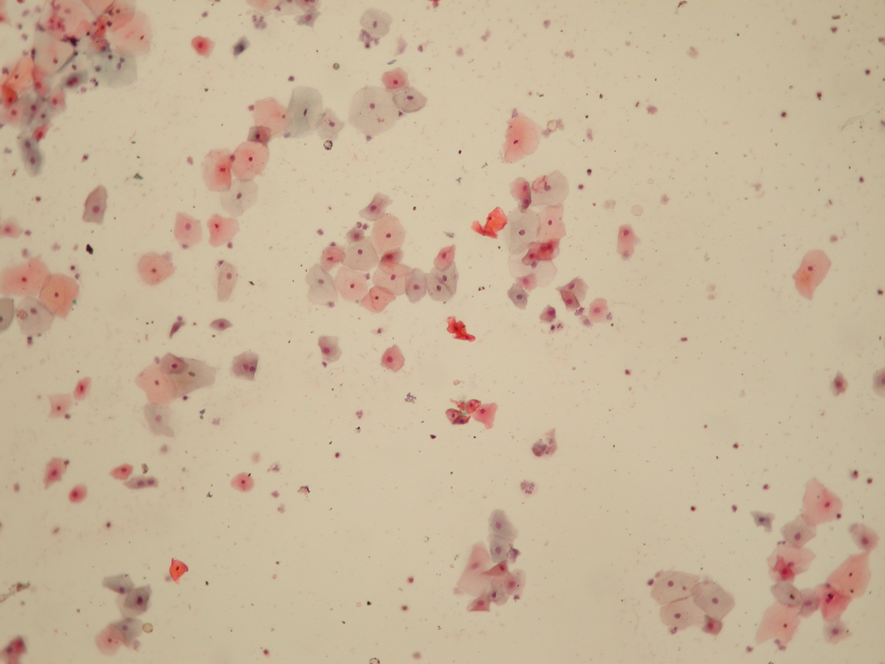

<div style="width: 100%; position: relative; text-align: center; color: white; margin-bottom: 20px;  max-height: 150px;">
  
  <h1 style="width:100%; position: absolute; top: 50%; left: 50%; transform: translate(-50%, -50%); font-size: 36px; text-shadow: 2px 2px 4px rgba(0, 0, 0, 0.5);">
    Segmentation model with Unet <br/>  SIPaKMeD
  </h1>
</div>

This project utilizes the **SIPaKMeD dataset** for the classification of normal and pathological cervical cells in Pap smear images. The dataset is publicly available for research and experimental purposes.

## Usage

Download the SIPaKMeD dataset from [official repository](https://www.cse.uoi.gr/~marina/sipakmed.html) and transfer into a folder's /pool (data folder)

```sh
# it is recommended to set up a (anaconda) venv 
pip install -r requirements.txt

python3 processing.py
python3 main.py
```

---

## Citation

If you use this dataset in your work, please cite the following paper:

> [**Marina E. Plissiti, Panagiotis Dimitrakopoulos, Giorgos Sfikas, Christophoros Nikou, Olga Krikoni, Antonia Charchanti**, *SIPAKMED: A new dataset for feature and image based classification of normal and pathological cervical cells in Pap smear images,* IEEE International Conference on Image Processing (ICIP) 2018, Athens, Greece, 7-10 October 2018.](https://sigport.org/documents/sipakmed-new-dataset-feature-and-image-based-classification-normal-and-pathological)

--- 

Feel free to contribute, report issues, or suggest improvements to the project!
